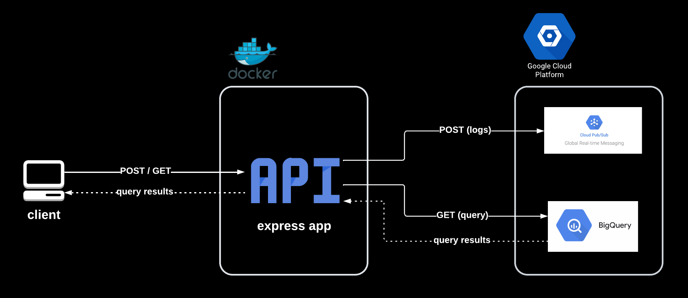

# Node.js Express API for Publishing Logs to Pub/Sub and Querying BQ


## Description
This is a Node.js express app as a data pipeline backend web service. It is designed to response following;
 - Post Request will paste json logs to BigQuery table.
 - Get Request will return a summary result from BigQuery table.
 - Service is designed to have data life cycle as;
 - Post Request-> Pub/Sub -> BigQuery Table -> Get Request


## Installation - Local Windows Environment
To start this application in your local environment run following commands;

### 1. Start Docker Desktop application. 
If you don't have Docker Desktop click [here](https://docs.docker.com/desktop/install/windows-install/) to install.

### 2. Clone this repo.  
```bash
git clone https://github.com/tmuratcamli/datapipeline-nodejs-gcp.git
````

### 3. Update .env file with corresponding values. 
```bash
GCP_PROJECT_ID = "gcp-project-id"
GCP_CREDENTIALS_KEY_PATH = "path-to-credential.json-of-service-account"
TOPIC_NAME = "pubsub-topic-name"
BQ_TABLE = "BigQuery-Table"
BQ_DATASET = "BigQuery-Dataset" 
BATCH_SIZE = 1000 
MAX_BATCH_SIZE = 1000
BATCH_DIVISION = 4
BACKOFF_BASE_DELAY_MS =  1000
MAX_BACKOFF_DELAY_MS = 60000
MAX_RETRY = 3

PORT = 3000
````

### 4. Build the Docker image
```bash
docker build -t your-app-name  . 
````

### 5. Run the Docker container
```bash
docker run -p 3000:3000 your-app-name
````

## USAGE 

### Prerequisites
There is no setup configuration for GCP services in the repository. Therefore following prerequisites must be created in GCP.
 - BigQuery Table
 - Pub/Sub Topic
 - Key Json file for service account that has following roles;
   - BigQuery Data Editor
   - BigQuery Data Transfer Service Agent
   - Pub/Sub Admin 

To get complete data life cycle data proccessing operation (from Pub/Sub to BQ) must be set. Code doesn't provide it.

### Log Schema  
API is designed to accept and publish JSON logs with a specified schema that is defined in ./models/schema.json file.   
```bash
{
    "$schema": "http://json-schema.org/draft-07/schema#",
    "title": "Log Schema",
    "type": "object",
    "properties": {
      "type": { "type": "string"},
      "session_id": { "type": "string"},
      "event_name": { "type": "string"},
      "event_time": { "type": "number"},
      "page": { "type": "string"},
      "country" : {"type": "string"},
      "region": { "type": "string"},
      "city": { "type": "string"},
      "user_id": { "type": "string"}
    },
    "required": ["type", "session_id", "event_name", "event_time", "user_id"]
  }
```

## NOTES
- As it is said before this project doesn't provide data proccesing for from Pub/Sub to BQ operation. 
- For Pub/Sub to BQ process; DataFlow, Cloud Functions, Cloud Run services can be considered.
- This project can be adapted to different use cases by modifying ./models/scjema.json and scripts/getQueries.js files.
